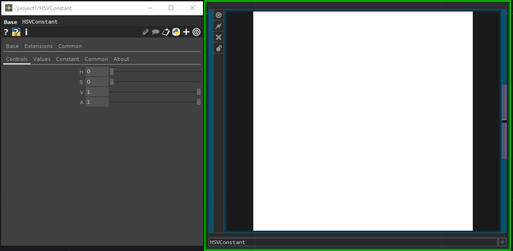

# hsv_constant
 Touchdesigner component. An HSVConstant TOP used for controling a constant using HSV sliders instead of RGBA. The HSV sliders can be controlled using python or chop references :).

 
